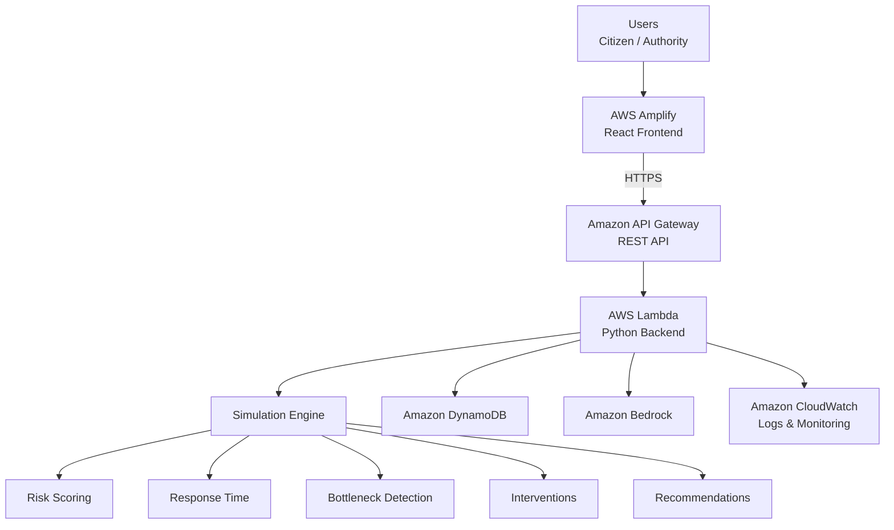
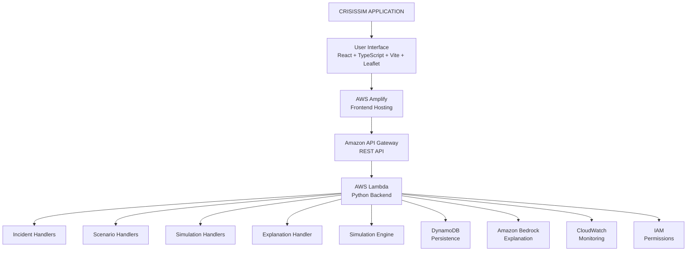

# 🚨 CrisisSim

## AI-Assisted Multi-Hazard Emergency Simulation & Decision Support

CrisisSim is a location-aware emergency simulation and decision-support platform that connects **citizen crisis reporting** with **authority assessment, deterministic multi-hazard simulation, bottleneck detection, and response strategy comparison**.

### Supported Hazards

🌊 Flood · 🔥 Fire · 🏚️ Earthquake · 🌀 Cyclone · ☣️ Industrial Accident

> ⚠️ **Prototype Disclaimer:** CrisisSim uses real-world geography but simulated emergency conditions, resources, facilities, risk zones, and response outcomes. It is not a production emergency-management system or real-time disaster intelligence platform.

---

# 🎯 Problem

During an emergency, receiving a citizen report is only the beginning.

Emergency personnel may need to understand:

- Where the incident is located
- What type of hazard is involved
- How severe the situation may be
- Which areas have higher simulated risk
- Where response bottlenecks may occur
- How resources could be allocated
- How different response strategies compare

Traditional incident reporting primarily records **what happened**.

CrisisSim extends the workflow from:

**Report → Assess → Simulate → Analyze → Compare → Decide**

---

# 💡 Solution

CrisisSim connects citizens and emergency personnel through a unified workflow:

```text
Citizen Report
      |
      v
Authority Assessment
      |
      v
Location-Aware Simulation
      |
      v
Risk & Bottleneck Analysis
      |
      v
What-If Strategy Comparison
      |
      v
Projected Impact
      |
      v
Decision Support
````

---

# 🛠️ Technology Stack

## Frontend

| Technology    | Purpose                                |
| ------------- | -------------------------------------- |
| React 18      | User interface                         |
| TypeScript    | Type-safe frontend development         |
| Vite          | Frontend development and build tooling |
| React-Leaflet | Interactive maps                       |
| Leaflet       | Map rendering                          |
| Axios         | API communication                      |
| CSS           | UI styling                             |

## Backend

| Technology         | Purpose                       |
| ------------------ | ----------------------------- |
| Python             | Backend and simulation engine |
| FastAPI            | Local development API         |
| AWS Lambda         | Serverless backend execution  |
| Amazon API Gateway | REST API layer                |

## Simulation & Decision Engine

| Component            | Purpose                                   |
| -------------------- | ----------------------------------------- |
| Risk Scorer          | Calculates simulated zone risk            |
| Response Time Engine | Estimates simulated response time         |
| Bottleneck Detector  | Identifies simulated resource constraints |
| Intervention Engine  | Applies response strategies               |
| Evaluator            | Compares simulation outcomes              |
| Recommender          | Produces strategy recommendations         |

## Data & Storage

| Technology      | Purpose                                    |
| --------------- | ------------------------------------------ |
| Amazon DynamoDB | Scenario and simulation-result persistence |
| In-memory Store | Local development persistence              |

## AI

| Technology             | Purpose                                                     |
| ---------------------- | ----------------------------------------------------------- |
| Amazon Bedrock         | Optional natural-language explanation of simulation results |
| Deterministic Fallback | Explanation when Bedrock is unavailable                     |

## Maps & Location

| Technology    | Purpose                       |
| ------------- | ----------------------------- |
| OpenStreetMap | Map tiles                     |
| Nominatim     | Location search and geocoding |

## Development & Testing

| Technology | Purpose                          |
| ---------- | -------------------------------- |
| Git        | Version control                  |
| GitHub     | Source repository                |
| Pytest     | Backend testing                  |
| Vitest     | Frontend testing                 |
| Kiro       | Specification-driven development |

---

# ☁️ AWS Services Used

CrisisSim is built using a serverless AWS architecture.

| AWS Service        | How CrisisSim Uses It                       |
| ------------------ | ------------------------------------------- |
| AWS Amplify        | Hosts and serves the React frontend         |
| Amazon API Gateway | Exposes the REST API                        |
| AWS Lambda         | Runs the Python backend and API handlers    |
| Amazon DynamoDB    | Stores scenarios and simulation results     |
| Amazon Bedrock     | Provides optional AI-generated explanations |
| Amazon CloudWatch  | Lambda monitoring and logs                  |
| AWS IAM            | Controls permissions between AWS resources  |

---

# 🏗️ AWS Architecture



---

# ✨ Key Features

## 👤 Citizen Crisis Reporting

Citizens can:

* Select a hazard
* Search for a real-world location
* Set incident severity
* Add a description
* Submit a crisis report
* Track report status

---

## 🏢 Authority Command Center

Authorities can:

* View reported incidents
* Inspect incident details
* View incident locations
* Update incident status
* Assess incoming reports
* Start a response simulation
* Trace simulations back to incidents

---

# 🔄 Incident Lifecycle

```text
Reported
   |
   v
Acknowledged
   |
   v
Assessing
   |
   v
Response Dispatched
   |
   v
Resolved
```

---

# 📍 Location-Aware Simulation

CrisisSim uses real-world geography to position simulated emergency scenarios.

The system generates deterministic simulated:

* Risk zones
* Facilities
* Resources
* Population impact
* Hazard conditions

### Real Geography + Simulated Conditions

The selected location determines the geographic center of the scenario, while the surrounding emergency conditions and assets are generated by the simulation prototype.

CrisisSim does **not** claim that generated zones, facilities, resources, hospitals, shelters, or emergency conditions represent live real-world data.

---

# 🌍 Multi-Hazard Simulation

| Hazard                 | Specialist Resources            |
| ---------------------- | ------------------------------- |
| 🌊 Flood               | Rescue teams, ambulances        |
| 🔥 Fire                | Fire crews                      |
| 🏚️ Earthquake         | Search & rescue teams           |
| 🌀 Cyclone             | Evacuation teams, utility crews |
| ☣️ Industrial Accident | Hazmat teams, containment units |

Each hazard has its own factors and specialist response resources.

---

# 📊 Risk & Bottleneck Analysis

The simulation evaluates factors such as:

* Affected population
* Hazard severity
* Medical urgency
* Road accessibility
* Resource shortage
* Hazard-specific conditions

It produces:

* Simulated zone risk levels
* Risk rankings
* Response-time estimates
* Resource bottlenecks
* Recommended interventions

---

# 🔄 What-If Analysis

Responders can compare:

* **Baseline**
* **Resource Reallocation**
* **Capacity Expansion**
* **Combined Intervention**

```text
Baseline
   |
   v
Simulation Result
   |
   v
Apply Strategy
   |
   +-----------------------+
   |           |           |
   v           v           v
Reallocation  Capacity    Combined
              Expansion
   |           |           |
   +-----------+-----------+
               |
               v
       Projected Impact
```

The comparison is based on the same simulation framework and existing model outputs rather than fabricated performance metrics.

---

# 🧠 Command Brief

After a simulation, CrisisSim summarizes:

* Hazard
* Overall risk
* Highest-risk zone
* Primary bottleneck
* Estimated response time
* Recommended intervention
* Reason for recommendation

The Command Brief is derived from simulation results.

---

# 🤖 AI-Assisted Explanation

The core emergency simulation is **not performed by an LLM**.

The deterministic engine performs:

```text
Risk Scoring
   |
   v
Response Time
   |
   v
Bottleneck Detection
   |
   v
Intervention Evaluation
   |
   v
Recommendation
```

Amazon Bedrock is then used as an optional explanation layer:

```text
Simulation Result
       |
       v
Amazon Bedrock
       |
       v
Natural-Language Explanation
```

If Bedrock is unavailable, a deterministic fallback explanation is used.

This separation ensures that the numerical simulation and decision calculations do not depend on an LLM.

---

# 🏗️ System Architecture



---

# 🧮 Simulation Engine

The simulation engine is a separate Python module and does not depend on the frontend or LLM.

```text
Scenario
   |
   v
Risk Scoring
   |
   v
Response-Time Estimation
   |
   v
Bottleneck Detection
   |
   v
Intervention Evaluation
   |
   v
Strategy Recommendation
   |
   v
Simulation Result
```

---

# 🧩 Hazard-Specific Factors

## 🌊 Flood

* Flood severity
* Water velocity
* Drainage failure

## 🔥 Fire

* Fire intensity
* Smoke exposure
* Spread potential

## 🏚️ Earthquake

* Structural damage
* Trapped-person likelihood
* Aftershock risk

## 🌀 Cyclone

* Wind severity
* Storm-surge exposure
* Power-outage severity

## ☣️ Industrial Accident

* Toxic-release severity
* Exposure level
* Containment failure

---

# 📁 Project Structure

```text
CrisisSim/
|
├── .kiro/
|   └── specs/
|       └── crisis-sim/
|           ├── requirements.md
|           ├── design.md
|           └── tasks.md
|
├── backend/
|   |
|   ├── bedrock/
|   |   └── explainer.py
|   |
|   ├── engine/
|   |   ├── models.py
|   |   ├── hazards.py
|   |   ├── risk_scorer.py
|   |   ├── response_time.py
|   |   ├── bottleneck_detector.py
|   |   ├── intervention_engine.py
|   |   ├── evaluator.py
|   |   └── recommender.py
|   |
|   ├── handlers/
|   |   ├── incidents.py
|   |   ├── scenarios.py
|   |   ├── simulation.py
|   |   └── explanation.py
|   |
|   ├── persistence/
|   |   ├── dynamodb.py
|   |   └── memory_store.py
|   |
|   ├── tests/
|   ├── lambda_function.py
|   ├── local_server.py
|   ├── seed_data.py
|   ├── deploy_aws.py
|   └── requirements.txt
|
├── frontend/
|   |
|   ├── public/
|   |
|   └── src/
|       ├── components/
|       ├── context/
|       ├── pages/
|       ├── services/
|       ├── styles/
|       ├── types/
|       └── utils/
|
├── .gitignore
└── README.md
```

---

# 🚀 Running Locally

## Prerequisites

Make sure you have:

* Python 3.12+
* Node.js
* npm
* Git

## 1. Clone the Repository

```bash
git clone https://github.com/nidhica/CrisisSim.git
cd CrisisSim
```

## 2. Start the Backend

```bash
cd backend
pip install -r requirements.txt
uvicorn local_server:app --reload --port 8000
```

The local API will run at:

```text
http://localhost:8000
```

## 3. Start the Frontend

Open another terminal:

```bash
cd frontend
npm install
npm run dev
```

Open the local URL displayed by Vite.

---

# 🧪 Testing

## Backend Tests

From the `backend` directory:

```bash
pytest
```

The backend test suite covers:

* Risk scoring
* Response-time calculations
* Bottleneck detection
* Intervention logic
* Recommendations
* Multi-hazard behavior
* Incident APIs
* Lambda handlers

## Frontend Tests

From the `frontend` directory:

```bash
npm test
```

The frontend test suite covers:

* Citizen reporting
* Incident workflows
* Simulation creation
* Location handling
* Map behavior
* Risk visualization
* Command Brief
* Projected Impact
* What-If analysis

## Production Build

From the `frontend` directory:

```bash
npm run build
```

---

# ☁️ AWS Deployment

CrisisSim uses a serverless AWS deployment.

The deployment tooling is located at:

```text
backend/deploy_aws.py
```

The deployment flow is:

```text
React Frontend
      |
      v
AWS Amplify
      |
      v
Amazon API Gateway
      |
      v
AWS Lambda
      |
      +----> Simulation Engine
      |
      +----> DynamoDB
      |
      +----> Bedrock Explanation Layer
```

The deployed architecture uses:

* AWS Amplify for frontend hosting
* Amazon API Gateway for the REST API
* AWS Lambda for backend execution
* Amazon DynamoDB for persistence
* Amazon Bedrock for optional explanation
* Amazon CloudWatch for logs and monitoring
* AWS IAM for permissions

> 🔐 **Security:** AWS credentials, access keys, private keys, environment secrets, and other sensitive configuration must never be committed to the repository.

---

# ⚠️ Prototype Limitations

CrisisSim is an **emergency simulation and decision-support prototype**.

It should not be interpreted as a production emergency-management or disaster-prediction system.

## Simulated Conditions

The following are simulated or generated by the platform:

* Hazard conditions
* Risk zones
* Facilities
* Resource availability
* Population impact
* Response-time estimates
* Bottlenecks
* Intervention outcomes

Real-world geography can be selected through location search, but the emergency conditions surrounding that location are simulated.

## Deterministic Simulation

The core simulation uses transparent deterministic coefficients and assumptions.

These assumptions are intended to demonstrate the decision-support workflow and have not been presented as validated emergency-response models.

Simulation outputs should therefore be interpreted as **prototype results**, rather than real-world predictions.

## AI Limitations

Amazon Bedrock is used as an explanation layer.

The core simulation calculations are performed by the deterministic simulation engine.

Bedrock does not determine:

* Risk scores
* Response times
* Bottlenecks
* Resource allocations
* Intervention outcomes

If Bedrock is unavailable, CrisisSim uses a deterministic fallback explanation.

## Operational Limitations

CrisisSim currently does not:

* Provide real-time disaster intelligence
* Connect to emergency dispatch systems
* Predict actual disasters
* Represent live hospital or shelter availability
* Issue real emergency alerts
* Replace trained emergency personnel
* Provide validated operational emergency instructions

> **CrisisSim should not be used to make real emergency-response decisions.**

---

# 🎯 Why CrisisSim?

CrisisSim focuses on the gap between:

> **Knowing that an incident occurred**

and:

> **Exploring how different response strategies could affect a simulated scenario.**

The complete workflow is:

```text
REPORT
  |
  v
ASSESS
  |
  v
SIMULATE
  |
  v
ANALYZE
  |
  v
COMPARE
  |
  v
DECIDE
```

This creates a unified workflow for exploring emergency-response scenarios across multiple hazard types.

---

# 📌 Project Status

CrisisSim currently demonstrates:

* ✅ Multi-hazard emergency simulation
* ✅ Citizen crisis reporting
* ✅ Authority incident management
* ✅ Location-aware scenarios
* ✅ Risk analysis
* ✅ Bottleneck detection
* ✅ Response strategy comparison
* ✅ What-If analysis
* ✅ Projected impact analysis
* ✅ Command Brief
* ✅ AWS serverless architecture
* ✅ DynamoDB persistence for scenarios and simulation results
* ✅ Optional Bedrock explanation
* ✅ Backend testing
* ✅ Frontend testing

---

# 🔗 Repository

**GitHub:**
[https://github.com/nidhica/CrisisSim](https://github.com/nidhica/CrisisSim)

---

# ⚖️ Disclaimer

CrisisSim is a prototype created for demonstrating emergency simulation and decision-support concepts.

All simulated emergency conditions, resources, facilities, risk zones, response times, and response outcomes are intended for demonstration purposes only.

The platform does not represent live emergency conditions and should not be used as a substitute for trained emergency personnel, official emergency systems, or validated emergency-response models.

````